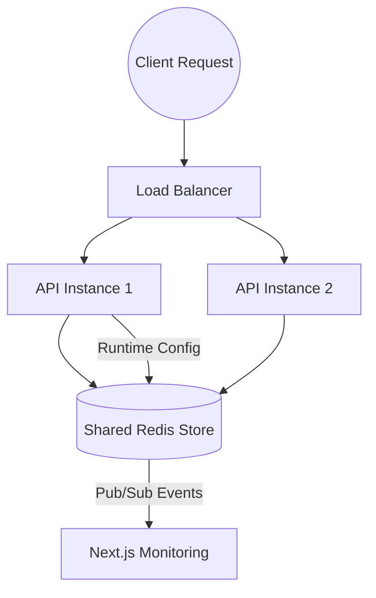

# 🛡️ Distributed API Rate Limiter

> **Handles 9.5k+ req/sec with P99 latency < 12ms on a single-node setup. Designed to protect high-traffic APIs, login endpoints, and multi-tenant SaaS systems from abuse.**

[](https://www.typescriptlang.org/)
[](https://redis.io/)
[](https://nextjs.org/)

---

## 🚀 Key Technical Highlights

*   **⚛️ Atomic Concurrency Control**: Uses **Redis Lua scripts** to ensure that rate-limit checks are atomic operations, eliminating race conditions in distributed environments.
*   **🧩 Multi-Algorithm Support**: Native support for **Token Bucket**, **Sliding Window**, and **Fixed Window** strategies.
*   **📊 Real-time Observability**: Near real-time monitoring via a **Next.js Dashboard** powered by Server-Sent Events (SSE).
*   **⚡ Low Latency**: Optimized Redis interactions ensuring ≈1–3ms latency at P95/P99 under heavy load.
*   **🛡️ Production-Grade Architecture**: Stateless Express backend designed for horizontal scaling.

---

## 🏗️ Architecture & System Design



### Why Redis Lua for Atomicity?
In a distributed environment, a standard `GET -> IF -> SET` pattern is vulnerable to race conditions. Two requests hitting different API nodes simultaneously could both read a token count of 1 and both proceed, exceeding the limit. 
*   **Decision**: I chose **Redis Lua scripts** because Redis executes them as a single atomic operation. 
*   **Trade-off**: This increases Redis CPU usage slightly compared to simple increments, but it guarantees 100% accuracy without the complexity of distributed locks (Redlock).

### Algorithm Selection: When to use which?
*   **Token Bucket**: I implemented this as the default because it allows for "burstiness"—a user can save up quota and use it all at once. This is the best "user-friendly" experience.
*   **Sliding Window**: Chosen for high-precision needs. It eliminates the "boundary problem" where a user could double their quota by hitting the API at the end of one window and the start of another.
*   **Fixed Window**: Included for high-throughput telemetry or logging where slight inaccuracies at window boundaries are acceptable in exchange for maximum performance.

### Fail-Open vs. Fail-Closed
*   **Decision**: The middleware is configured to **Fail-Open**. 
*   **Reasoning**: In a production SaaS environment, it is usually better to allow a few extra requests through during a Redis outage than to bring down your entire login system because the rate-limiter is down.

---

## ⚠️ Failure Handling & Resilience

In a production environment, the rate limiter must not become a single point of failure.
*   **Fail-Open Strategy**: If Redis becomes unavailable or times out, the system automatically triggers a **fail-open** mechanism, allowing requests through to prevent cascading failures in the upstream services.
*   **Timeout Management**: Strict timeouts on Redis connections (200ms) ensure that a slow cache doesn't block the entire request pipeline.
*   **Graceful Degradation**: Error logging and health checks notify DevOps teams immediately while the system maintains uptime.

---

## 📊 Scalability & Bottlenecks

### Current Performance (Verified)
*   **Throughput**: 9.5k+ req/sec
*   **P95 Latency**: 8.0ms
*   **P99 Latency**: 11.6ms
*   **Full Report**: See [BENCHMARKS.md](./BENCHMARKS.md)

### Scaling to the Next Level
While the current single-node setup is highly performant, the bottleneck is the Redis CPU (due to Lua execution).
*   **Horizontal Scaling**: Transition to **Redis Cluster** to distribute keys across multiple shards.
*   **Sharding Strategy**: Partition traffic by `clientId` or `IP` to ensure hot keys are balanced.
*   **Pipeline Optimization**: Batching metrics updates to further reduce round-trip times.

---

## 🛠️ Algorithms & Trade-offs

| Algorithm | Pros | Cons | Best For |
| :--- | :--- | :--- | :--- |
| **Token Bucket** | Smooths out traffic, allows for bursts. | Memory overhead for state. | Standard API protection. |
| **Sliding Window** | Most accurate, no boundary spikes. | Slightly higher Redis CPU. | High-precision quotas. |
| **Fixed Window** | Simplest and fastest. | Allows 2x burst at boundaries. | High-volume logging/telemetry. |

---

## 🏁 Quick Start

```bash
# Terminal 1: Backend
npm install && npm run dev

# Terminal 2: Dashboard
cd dashboard
npm install && npm run dev -- -p 3001
```

---

## 🧪 Benchmarking
```bash
# Run load test (100 VUs, 1 min)
k6 run tests/load/k6-basic.js
```

---

## 📄 License
MIT License. Created by Prachi Bhushan.
